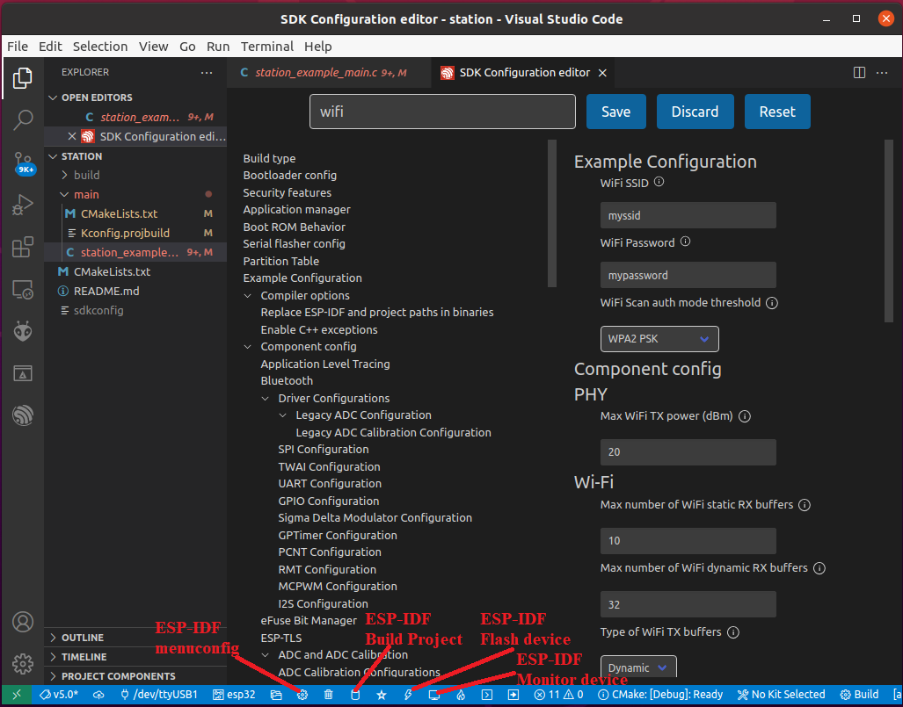
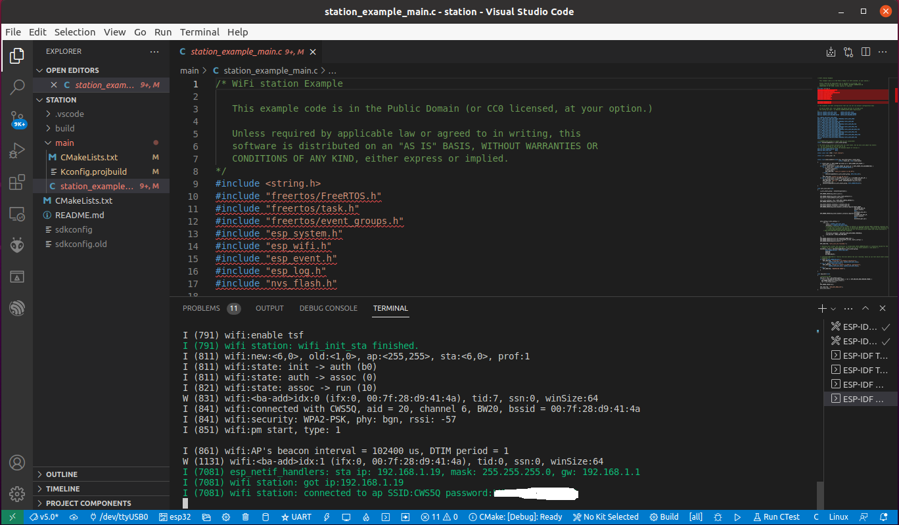
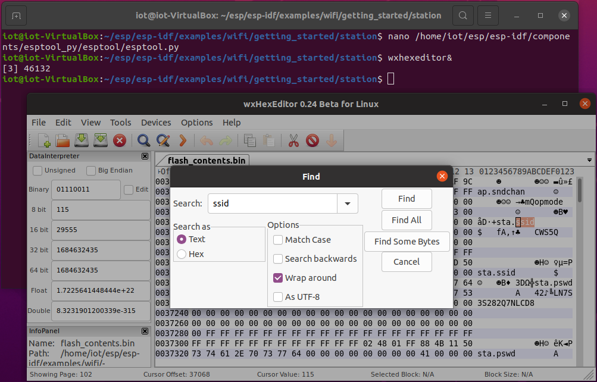
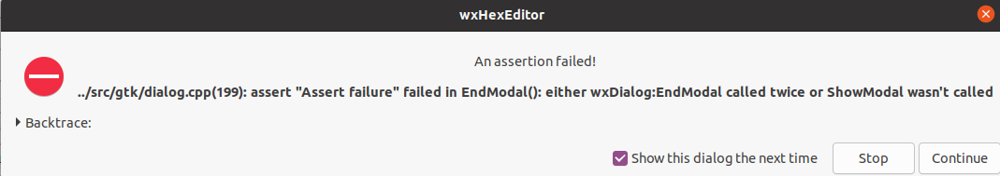

# ESP32 UART and Flash Hack 

In this lab, students will learn how to ethically hack the flash memory of a ESP32 through it's UART port.

There are three serial ports on the original ESP32. UART0 is often used for programming and communication with devices outside of the ESP32 while the other two UART ports are unused. The Micro-USB connector of our IoT kit is connected to UART0 through a USB-UART bridge chip. If there is no protection of the UART0 interface, a hacker can access the flash through UART0. The access to UART can be protected by a password. That is, a user must enter the correct password to upload firmware and communicate with the IoT kit. 

If the UART ports and flash of a device are not protected, various exploits are possible.

## Build and run the WiFi station firmware

In this lab, we will work on the [WiFi station example](https://github.com/espressif/esp-idf/tree/master/examples/wifi/getting_started/station) in our environment. On our Ubuntu VM, through VS Code, we can build the */home/iot/esp/esp-idf/examples/wifi/getting_started/station/* project, which connects the IoT kit to a wireless router (often called AP), and flash the firmware onto the IoT kit.

### Open the WiFi station example project
Within VS Code, open the tab *File* -> *Open Folder* ... -> Navigate to the folder /home/iot/esp/esp-idf/examples/wifi/getting_started/station/ -> *Open*


### Configure WiFi

Once the WiFi station example project is opened, within VS Code, click the *ESP-IDF menuconfig* icon as shown in the screenshot below, then use the search bar to find the WiFi options. Configure the *WiFi SSID* and *WiFi Password* then *Save* as shown in the screenshot below.



### Build, flash and monitor

Please refer to the screenshot above, build the project, flash device and monitor device.
1. Build Project. *Show Running Tasks* to see the progress while building the project.
2. Flash device. Choose the right USB port, e.g., /dev/ttyUSB0. You may need to *Open ESP-IDF Terminal* to see the progress of flashing so that you can press the BOOT button on the board to flash the device.
3. Monitor device. You shall see the ESP32 device is connected to the WiFi as the screenshot shown below.



## Retrieve partition table
We now can perform the ethical hacking of the IoT kit, we will try to obtain the WiFi credentials embedded in the firmware and even modify the firmware. This has to be done within a terminal. We will use the ESP-IDF terminal within VS Code to do it.

### Start ESP-IDF terminal

*Open ESP-IDF Terminal* as shown in the screenshot in [Configure WiFi](#configure-wifi). Within the terminal, run the following command to set environment variables for all the ESP-IDF tools.
```sh
. $HOME/esp/esp-idf/export.sh
```

### Read flash

**Note**: The some esp-idf versions have a bug with the Python tool *esptool.py*. They will need the following shebang line added to the start of the code at /home/iot/esp/esp-idf/components/esptool_py/esptool/esptool.py if the shebang line is missing. Any text editor can be used to add this line, one example is *nano*.
```
#!/usr/bin/env python
```

Please refer to [the use of esptool.py](https://docs.espressif.com/projects/esptool/en/latest/esp32/) for more information. The following command will retrieve the partition table of the IoT kit flash in the binary format:
```sh
esptool.py read_flash 0x8000 0xc00 ptable.img
```
where 0x8000 is the start address of the partition table and 0xc00 is the length of the partition table. The binary partition table is saved in ptable.img. 

### Print out partition table

Please refer to [the use of gen_esp32part.py](https://docs.espressif.com/projects/esp-idf/en/latest/esp32/api-guides/partition-tables.html) for more information. The following command will print out the partition table of our IoT kit in the CSV (comma-separated values) format. The partition table shows how the flash memory of the ESP32 is partitioned. 
```sh
gen_esp32part.py ptable.img
```

## Search firmware for sensitive info
### Retrieve firmware
The following command retrieves the entire flash memory of the device although students can also refer to the partition table and print out only the occupied part of the flash.
```
esptool.py read_flash 0 0x400000 flash_contents.bin
```
The first numeric value 0 is the starting address and 0x400000 is the length of the flash to copy which is the total size of the ESP32-WROOM-32 surface-mount module board's flash that our IoT kit uses. The entire flash in the binary format will be saved in the flash_contents.bin file. 

### View firmware and search for sensitive info
Students can use a hex editor (e.g. wxhexeditor) to search the WiFi credentials in the flash dump. 

**wxhexeditor is already installed in our Ubuntu VM**. You don't have to reinstall the program if it is already present. However, if needed, you can use the following commands to install and set up wxhexeditor.
```sh
sudo apt-get install wxhexeditor                      #Install wxhexeditor  and then run wxHexEditor
sudo ln -s /usr/bin/wxHexEditor /usr/bin/wxhexeditor  #Create a symbolic to use the lowercase command wxhexeditor
```

This can be launched from the application page of Ubuntu, or the *Terminal*. The following is how to launch wxhexeditor and open a file "flash_contents.bin" from the *Terminal*.
```sh
wxhexeditor flash_contents.bin
```

The following screenshot shows how to use *Edit* -> *Find* within wxhexeditor to search for some text.




**Notice**: When you run wxhexeditor, you may get an error when using the **find** utility as shown below. Click **Continue**, otherwise the program will exit.



## Change the firmware
The hex editor (e.g. wxhexeditor) can be used to change the flash dump. The changed flash dump can be flash back to the IoT kit. Another firmware may be written. esptool.py can be used to write the changed firmware back to the ESP32.
```sh
esptool.py write_flash 0 flash_contents_good.bin
```

# Notes

[HxD](https://mh-nexus.de/en/hxd/) is a better freeware hex editor and disk editor for Windows than wxhexeditor.
